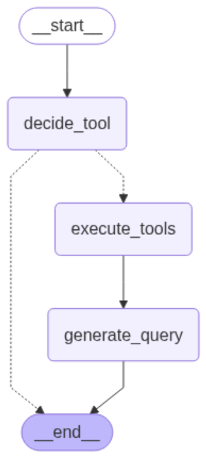

# 🧠 AI Agent - Finance stocks assistant

An intelligent chatbot built with LangGraph and OpenAI, capable of retrieving information about companies and financial stocks. The bot leverages specialized tools to process queries about various types of companies and deliver detailed, accurate information.

📅 Data range: The S&P 500 database is updated from 2021-01-01 to 2024-09-30.


## 🚀 Features
- **Conversational Interface**: User-friendly web interface built with Gradio

- **Vector Database**: Uses ChromaDB to store and retrieve S&P 500 company data

- **Smart Query Routing**: Employs LangGraph to manage complex conversational flows

- **Real Financial Data**: Includes real company data (historical prices, general info, and wiki entries)

- **Specialized Tools**: Dedicated tools for querying specific company-related data

- **Persistent Memory**: Maintains conversation context across messages

- **Modular Architecture**: Well-organized and easy-to-maintain codebase

## 🏗️ Architecture

The system uses an agent-based architecture composed of the following main components:

### Core Components

1. **AgentGraph** – Main orchestrator that manages the conversation flow  
2. **MainNodes** – Decision logic for routing and tool invocation  
3. **ToolboxMain** – Toolset for querying company information  
4. **AgentQuery** – Specialized agent for querying ChromaDB  
5. **ChromaDB** – Vector database storing the S&P 500 company information  
6. **ChatInterface** – Gradio-based user interface  

### Processing Flow

 

### Data Sources

- `sp500_hist_data.csv`: Historical stock prices  
- `sp500_info.csv`: General company information  
- `sp500_wiki_database.csv`: Wikipedia-based company profiles  

## 📋 Requirements

- Python 3.11+
- OpenAI API key
- Dependencies listed in `requirements.txt`
- S&P 500 data files in the `/db/` directory

## 🛠️ Installation

1. **Clone the repository**
```bash
git clone <repo-url>
cd chatbot-finance-stocks
```

2. **Install uv (if you don't have it)**
```bash
# macOS/Linux
curl -LsSf https://astral.sh/uv/install.sh | sh

# Windows (PowerShell)
powershell -c "irm https://astral.sh/uv/install.sh | iex"
```

3. **Set up the project environment**
```bash
# Create virtual environment and install dependencies
uv sync

# Pin Python version (if needed)
uv python pin 3.11
```


4. **Set environment variables**
```bash
cp .env.example .env
```

Edit the `.env` file and add your API key:
```
OPENAI_API_KEY=your_api_key_here
```

5. **⚠️ IMPORTANT: Set up the ChromaDB database**

Before running the application, you must create the vector database:

```bash
uv run python setup_chromadb.py
```

This script processes the CSV files and builds the ChromaDB required by the agent.

## 🚀 Running the Application

```bash
uv run python gradio_main.py
```

The app will launch at `http://127.0.0.1:7860` by default.

### Example Queries

- "Tell me companies which make cars"
- "Show me companies that make movies"
- "What companies are in the tech sector?"

## 📁 Project Structure

```
chatbot-finance-stocks/
├── agent/
│   ├── __init__.py
│   ├── agent_graph.py          # Main conversation graph
│   └── utils/
│       ├── nodes.py            # Node logic
│       ├── tools.py            # tools logic
│       └── states.py           # states logic
├── chroma_db/                  # ChromaDB (auto-generated)
├── db/                         # Raw S&P 500 data
│   ├── sp500_hist_data.csv
│   ├── sp500_info.csv
│   └── sp500_wiki_database.csv
├── app.py                      # Run app
├── config_parameters.yml       # Configuration (model, etc)
├── prompts.yml                 # System prompts
├── requirements.txt            # Dependencies
├── setup_chromadb.py           # Vector DB setup
└── README.md                   # This file
```

## 🔧 Configuration

### Environment Variables

| Variable         | Description                 | Default                  |
|------------------|-----------------------------|--------------------------|
| `OPENAI_API_KEY` | Your OpenAI API Key         | Required                 |


## 📄 License
This project is licensed under the MIT License.

Made with 💻 by [**Aranza1424**](https://github.com/aranza1424)